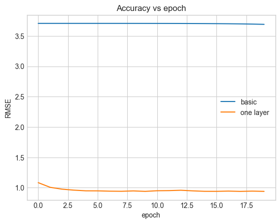

---

# Système de Recommandation basé sur les Réseaux de Neurones


*Mastère Spécialisé Data Science pour la Connaissance Client*

---

## Introduction

Dans ce projet, nous avons conçu et implémenté un **système de recommandation de films** basé sur des **réseaux de neurones**.
Les systèmes de recommandation sont devenus essentiels dans de nombreux domaines (Netflix, Spotify, e-commerce), et l’objectif est de prédire les préférences d’un utilisateur en se basant sur ses interactions passées.

Le dataset utilisé est **[MovieLens 100K](https://grouplens.org/datasets/movielens/100k/)**, contenant plus de 100 000 évaluations de films par différents utilisateurs.

---

## Technologies utilisées

* [TensorFlow](https://www.tensorflow.org/) & [Keras](https://keras.io/)
* [TensorFlow Recommenders (TFRS)](https://www.tensorflow.org/recommenders)
* [TensorFlow Datasets](https://www.tensorflow.org/datasets)
* Python 3.x
* NumPy, Matplotlib, Pandas

---

## Structure du projet

* **Basic recommender** → modèle simple de factorisation matricielle (produit scalaire entre embeddings).
* **One Layer model** → ajout d’une couche dense pour capturer des relations plus complexes.
* **Enriched model** → intégration d’informations contextuelles (timestamps, titres des films).
* **Complex model** → ajout de données supplémentaires (âge des utilisateurs, genres des films) et architecture plus profonde.

---

## Résultats (RMSE)

| Modèle        | RMSE final |
| ------------- | ---------- |
| **Basic**     | 3.695      |
| **One Layer** | 0.941      |
| **Enriched**  | 0.936      |
| **Complex**   | 0.960      |

👉 On observe une **forte amélioration** en ajoutant des couches et du contexte, mais une complexité excessive peut entraîner un sur-apprentissage.

---

## Visualisation


*Évolution du RMSE sur l’ensemble de validation en fonction des époques.*

---

##  Lancer le projet

### 1. Cloner le repo

```bash
git clone https://github.com/dfrey/MyCode.git
cd MyCode
```

### 2. Lancer le notebook

```bash
jupyter notebook NN_based_recommender_system.ipynb
```

---

## Conclusion

* Les **modèles simples (Basic)** atteignent vite leurs limites.
* L’ajout de **couches supplémentaires** et **d’informations contextuelles** améliore sensiblement la précision.
* Cependant, plus de complexité ≠ toujours meilleures performances.
* Pour aller plus loin : intégrer plus de métadonnées (profils utilisateurs, notes textuelles), tester des architectures **CNN/Transformers**.

---


"# NEURAL-RECOMMENDER-SYSTEM" 
